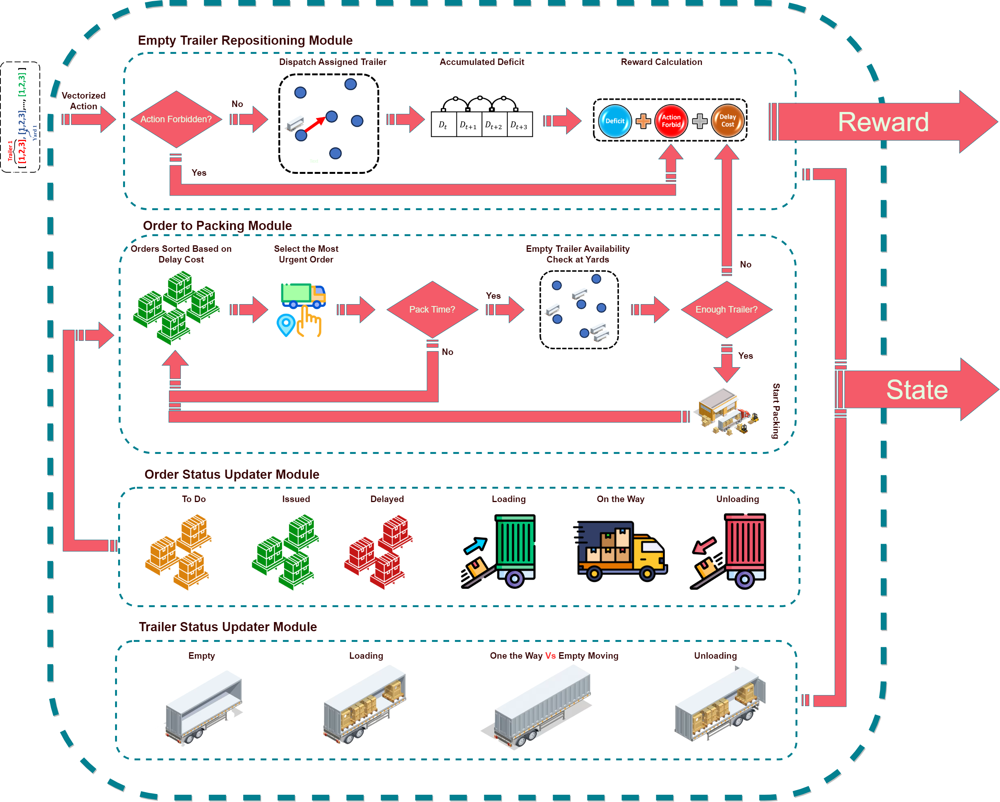

# Drayage Trailer Dispatching RL Environment

A Gymnasium-compatible reinforcement learning environment for optimizing empty trailer repositioning in drayage operations.



## Overview

This environment models the complex problem of managing a fleet of trailers across multiple yards to fulfill drayage orders while minimizing delays and maintaining optimal trailer distribution. The agent must make strategic decisions about repositioning empty trailers to ensure they're available when and where orders need them.

This is the official implementation of the environment described in:

> **Dray-Q: Demand-dependent trailer repositioning using deep reinforcement learning**  
> Hadi Aghazadeh, Yunli Wang, Sun Sun, Xin Wang  
> *Transportation Research Part C: Emerging Technologies*, Volume 163, 2024  
> [https://doi.org/10.1016/j.trc.2024.104641](https://doi.org/10.1016/j.trc.2024.104641)

### Key Features

- **Gymnasium-compatible interface** for easy integration with standard RL libraries (Stable-Baselines3, RLlib, etc.)
- **Multi-objective optimization** balancing trailer distribution and order delays
- **Time-window constraints** with realistic pickup and delivery schedules
- **N-step lookahead** for anticipating future trailer deficits
- **Importance-weighted yards** to prioritize critical locations
- **Realistic operational constraints** including loading times, travel times, and yard capacities
- **Stochastic episode generation** with randomized order schedules for robust policy learning

## Problem Description

### Entities

**Trailers**: Mobile resources that can be in one of six states:
- `EMPTY`: Available for repositioning or order assignment
- `LOADING`: Being loaded with cargo at pickup location
- `LOADED`: Ready to depart with cargo
- `ON_THE_WAY`: Traveling to delivery location
- `UNLOADING`: Being unloaded at delivery location
- `EMPTY_MOVING`: Being repositioned to another yard

**Orders**: Drayage jobs with:
- Pickup and delivery yard locations
- Time windows for pickup and delivery
- Loading and unloading durations
- Delay penalties for missed time windows

**Yards**: Depot locations with:
- Minimum empty trailer requirements
- Importance weights (criticality)
- Attachment/detachment times

### Decision Problem

At each time step, the agent must decide:
- **Which empty trailer** to reposition (if any)
- **Which yard** to send it to

Meanwhile, the environment automatically:
- Assigns empty trailers to waiting orders when available
- Executes ongoing loading, transport, and unloading operations
- Tracks time-window violations and applies delay penalties

## Installation

### Prerequisites

```bash
pip install gymnasium numpy
```

### Installing the Environment

```bash
# Clone the repository
git clone https://github.com/hadiagha/Drayage_Operation_RL_Environment.git
cd drayage-rl-env

# Install in development mode
pip install -e .
```

Or install directly from GitHub:

```bash
pip install git+https://github.com/hadiagha/Drayage_Operation_RL_Environment.git
```

## Quick Start

```python
import numpy as np
from drayage_trailer_dispatching_env import DrayageEnv

# Define problem configuration
num_trailers = 5
num_yards = 3

# Sample orders configuration
orders_config = [
    {
        'pickup_tw': (8.0, 10.0),      # 8am-10am pickup window
        'delivery_tw': (14.0, 16.0),   # 2pm-4pm delivery window
        'pickup_duration': 30,          # 30 minutes loading
        'delivery_duration': 20,        # 20 minutes unloading
        'cost': 100.0
    },
    {
        'pickup_tw': (9.0, 11.0),
        'delivery_tw': (15.0, 17.0),
        'pickup_duration': 45,
        'delivery_duration': 30,
        'cost': 100.0
    },
    # Add more orders...
]

# Travel time matrix (minutes between yards)
travel_times = np.array([
    [0, 45, 60],
    [45, 0, 30],
    [60, 30, 0]
])

# Yard configurations
yard_min_empty = [2, 1, 1]         # Minimum empty trailers per yard
yard_importance = [1.0, 0.8, 0.6]  # Importance weights
yard_attach_times = [10, 10, 10]   # Minutes to attach/detach

# Create environment
env = DrayageEnv(
    num_trailers=num_trailers,
    num_yards=num_yards,
    orders_config=orders_config,
    travel_time_matrix=travel_times,
    yard_min_empty=yard_min_empty,
    yard_importance=yard_importance,
    yard_attach_times=yard_attach_times,
    step_minutes=15,        # 15-minute time steps
    min_hour=6,             # Start at 6am
    max_hour=24,            # End at midnight
    n_step_deficit=4,       # 4-step lookahead (1 hour)
    delay_cost_per_step=70.0,
    forbidden_action_penalty=30.0,
    laplace_scale=1.0,
    seed=42
)

# Run episode
obs, info = env.reset()
done = False
total_reward = 0

while not done:
    # Random action: choose trailer and yard
    action = env.action_space.sample()
    obs, reward, terminated, truncated, info = env.step(action)
    total_reward += reward
    done = terminated or truncated

print(f"Episode reward: {total_reward}")
print(f"Orders delivered: {info['orders_delivered']}")
print(f"Total delay cost: {info['total_delay_cost']}")
```

## State Space

The observation is a vector with shape `(num_trailers + num_yards,)`:

```
State = [trailer_0_empty, trailer_1_empty, ..., trailer_n_empty,
         yard_0_deficit, yard_1_deficit, ..., yard_m_deficit]
```

**Components:**
- **Trailer status** (first `num_trailers` elements): Binary (1 if empty and available, 0 otherwise)
- **Yard deficit** (last `num_yards` elements): Integer representing the n-step deficit calculation:
  
  ```
  Deficit_i = (Incoming_i - Outgoing_i) + CurrentCapacity_i - MinLevel_i
  ```
  
  Where:
  - `Incoming_i`: Trailers arriving at yard i in next n steps
  - `Outgoing_i`: Trailers departing from yard i in next n steps
  - `CurrentCapacity_i`: Number of empty trailers currently at yard i
  - `MinLevel_i`: Minimum required empty trailers at yard i
  
  Interpretation:
  - Negative values indicate shortage (need more trailers)
  - Positive values indicate surplus (excess trailers)
  - Zero indicates optimal balance

## Action Space

Discrete action space with `num_trailers × num_yards` possible actions.

Each action is encoded as: 

```
action = trailer_id * num_yards + yard_id
```

To decode an action:

```python
trailer_id = action // num_yards
yard_id = action % num_yards
```

**Action Constraints:**
- Only empty trailers can be repositioned
- Attempting to move a busy trailer results in:
  - A penalty equal to `forbidden_action_penalty`
  - Episode termination

## Reward Function

Multi-objective reward combining three components (Equation 3 from the paper):

```
R = w_a × Σ(L(D_i) × Importance_i) - w_b × Σ(Delay_i) - w_c × ForbiddenPenalty
```

Where:
- **L(D_i)**: Laplace distribution evaluation of yard deficit (Equation 6)
- **Importance_i**: Yard importance weight
- **Delay_i**: Accumulated delay costs from missed time windows (Equation 4)
- **ForbiddenPenalty**: Penalty for invalid actions

### Component Details

1. **Deficit Reward** (w_a = 100): Encourages maintaining optimal trailer distribution
   ```
   L(D) = (1 / 2λ) * exp(-|D| / λ)
   ```
   where λ is the Laplace scale parameter (default: 1.0)

2. **Delay Cost** (w_b = 1, default: 70 per step): Penalizes orders waiting without trailers
   - Applied when order cannot start loading due to trailer unavailability
   - Accumulated over multiple time steps if delay persists

3. **Forbidden Penalty** (w_c = 1, default: 30): Discourages invalid repositioning attempts

## Configuration Parameters

### Environment Parameters

| Parameter | Type | Default | Description |
|-----------|------|---------|-------------|
| `num_trailers` | int | Required | Number of trailers in the fleet |
| `num_yards` | int | Required | Number of yard locations |
| `orders_config` | List[Dict] | Required | List of order specifications |
| `travel_time_matrix` | np.ndarray | Required | Travel times (minutes) between yards |
| `yard_min_empty` | List[int] | Required | Minimum empty trailers per yard |
| `yard_importance` | List[float] | Required | Importance weight per yard |
| `yard_attach_times` | List[int] | Required | Attach/detach time (minutes) per yard |

### Time Management

| Parameter | Type | Default | Description |
|-----------|------|---------|-------------|
| `step_minutes` | int | 15 | Duration of each time step (minutes) |
| `min_hour` | int | 6 | Start of operational day (hour) |
| `max_hour` | int | 24 | End of operational day (hour) |

### Lookahead & Planning

| Parameter | Type | Default | Description |
|-----------|------|---------|-------------|
| `n_step_deficit` | int | 4 | Number of steps for deficit calculation |
| `laplace_scale` | float | 1.0 | Scale parameter λ for Laplace distribution |

### Cost Parameters

| Parameter | Type | Default | Description |
|-----------|------|---------|-------------|
| `delay_cost_per_step` | float | 70.0 | Penalty per step of delay |
| `forbidden_action_penalty` | float | 30.0 | Cost for invalid actions |

### Other

| Parameter | Type | Default | Description |
|-----------|------|---------|-------------|
| `seed` | int | None | Random seed for reproducibility |

## Training with Popular RL Libraries

### Stable-Baselines3

```python
from stable_baselines3 import PPO, DQN, A2C
from stable_baselines3.common.env_checker import check_env
from drayage_trailer_dispatching_env import DrayageEnv

# Create and verify environment
env = DrayageEnv(...)
check_env(env)

# Train with PPO
model = PPO(
    "MlpPolicy", 
    env, 
    verbose=1,
    learning_rate=3e-4,
    n_steps=2048,
    batch_size=64,
    n_epochs=10,
    gamma=0.99,
    tensorboard_log="./drayage_tensorboard/"
)

model.learn(total_timesteps=100000)
model.save("drayage_ppo")

# Evaluate
model = PPO.load("drayage_ppo")
obs, info = env.reset()
for _ in range(100):
    action, _states = model.predict(obs, deterministic=True)
    obs, reward, terminated, truncated, info = env.step(action)
    if terminated or truncated:
        break

print(f"Final delivery rate: {info['orders_delivered']/len(env.orders)*100:.1f}%")
```

### RLlib (Ray)

```python
from ray.rllib.algorithms.ppo import PPOConfig
from drayage_trailer_dispatching_env import DrayageEnv

config = (
    PPOConfig()
    .environment(env=DrayageEnv, env_config={
        "num_trailers": 5,
        "num_yards": 3,
        # ... other config
    })
    .framework("torch")
    .training(
        lr=3e-4,
        train_batch_size=4000,
        sgd_minibatch_size=128,
    )
    .resources(num_gpus=1)
)

algo = config.build()
for i in range(100):
    result = algo.train()
    print(f"Iteration {i}: reward={result['episode_reward_mean']}")
```

## Advanced Usage

### Custom Order Generation

```python
import numpy as np

def generate_realistic_orders(num_orders, num_yards, seed=None):
    """Generate orders with realistic time distributions"""
    rng = np.random.RandomState(seed)
    orders = []
    
    for i in range(num_orders):
        # Morning pickups (7am-12pm)
        pickup_start = rng.uniform(7, 12)
        pickup_end = pickup_start + rng.uniform(1, 3)
        
        # Afternoon deliveries (1pm-6pm)
        delivery_start = rng.uniform(13, 16)
        delivery_end = delivery_start + rng.uniform(1, 3)
        
        orders.append({
            'pickup_tw': (pickup_start, pickup_end),
            'delivery_tw': (delivery_start, delivery_end),
            'pickup_duration': int(rng.uniform(20, 60)),
            'delivery_duration': int(rng.uniform(15, 45)),
            'cost': 100.0
        })
    
    return orders

# Use in environment
orders = generate_realistic_orders(num_orders=20, num_yards=5, seed=42)
env = DrayageEnv(orders_config=orders, ...)
```

### Action Masking

Improve training efficiency by masking invalid actions:

```python
import numpy as np
from gymnasium import spaces

class MaskedDrayageEnv(DrayageEnv):
    def __init__(self, *args, **kwargs):
        super().__init__(*args, **kwargs)
        
    def get_action_mask(self):
        """Return binary mask of valid actions"""
        mask = np.zeros(self.action_space.n, dtype=np.int8)
        
        for trailer_id in range(self.num_trailers):
            if not self._is_action_forbidden(trailer_id):
                for yard_id in range(self.num_yards):
                    action = trailer_id * self.num_yards + yard_id
                    mask[action] = 1
        
        return mask
    
    def step(self, action):
        obs, reward, terminated, truncated, info = super().step(action)
        info['action_mask'] = self.get_action_mask()
        return obs, reward, terminated, truncated, info

# Use with SB3-Contrib MaskablePPO
from sb3_contrib import MaskablePPO

env = MaskedDrayageEnv(...)
model = MaskablePPO("MlpPolicy", env, verbose=1)
model.learn(total_timesteps=100000)
```

### Custom Reward Shaping

Extend the environment to customize the reward function:

```python
class CustomDrayageEnv(DrayageEnv):
    def _calculate_reward(self, forbidden: bool) -> float:
        base_reward = super()._calculate_reward(forbidden)
        
        # Add custom penalty for trailer imbalance across yards
        trailer_distribution = [
            sum(1 for t in self.trailers.values() if t.current_yard_id == y)
            for y in range(self.num_yards)
        ]
        imbalance_penalty = np.std(trailer_distribution) * 5.0
        
        # Bonus for high delivery rate
        delivery_rate = sum(1 for o in self.orders.values() 
                           if o.status == OrderStatus.DELIVERED) / len(self.orders)
        delivery_bonus = delivery_rate * 50.0 if self.current_step > len(self.time_steps) - 10 else 0.0
        
        return base_reward - imbalance_penalty + delivery_bonus
```

### Multi-Environment Training

Train on multiple configurations for robustness:

```python
from stable_baselines3.common.vec_env import SubprocVecEnv

def make_env(rank, seed=0):
    def _init():
        env = DrayageEnv(
            num_trailers=5 + rank,  # Vary fleet size
            num_yards=3,
            orders_config=generate_realistic_orders(15 + rank*5, 3, seed+rank),
            # ... other params
            seed=seed + rank
        )
        return env
    return _init

# Create vectorized environment
num_envs = 4
env = SubprocVecEnv([make_env(i, seed=42) for i in range(num_envs)])

model = PPO("MlpPolicy", env, verbose=1)
model.learn(total_timesteps=500000)
```

## Evaluation Metrics

The environment provides several metrics through the `info` dictionary:

```python
obs, info = env.reset()

# During episode
obs, reward, terminated, truncated, info = env.step(action)

print(f"Current time step: {info['current_step']}")
print(f"Total delay cost: {info['total_delay_cost']}")
print(f"Orders delivered: {info['orders_delivered']}")
print(f"Orders delayed: {info['orders_delayed']}")

# Calculate custom metrics
total_orders = len(env.orders)
delivery_rate = info['orders_delivered'] / total_orders
on_time_rate = (total_orders - info['orders_delayed']) / total_orders
```

## Performance Considerations

- **Episode length**: Typically 72 steps for an 18-hour operational day (6am-12am) with 15-minute steps
- **State dimension**: `num_trailers + num_yards` (e.g., 5 trailers + 3 yards = 8-dimensional state)
- **Action space**: `num_trailers × num_yards` (e.g., 5 × 3 = 15 discrete actions)

### Scaling to Larger Problems

For large-scale problems (50+ trailers, 20+ yards):

1. **Action masking**: Prevent invalid actions to improve sample efficiency
2. **Hierarchical policies**: Decompose decision into "which yard needs trailers?" then "which trailer to send?"
3. **Graph neural networks**: Model spatial relationships between yards
4. **Attention mechanisms**: Handle variable numbers of trailers and orders

Example action space sizes:
- Small: 5 trailers × 3 yards = 15 actions
- Medium: 20 trailers × 10 yards = 200 actions
- Large: 50 trailers × 20 yards = 1,000 actions

## Methodology Reference

This environment implements the Dray-Q methodology as described in the paper:

### Key Equations

**Equation 2 - N-step Deficit:**
```
D_i(t, n) = (Incoming_i - Outgoing_i) + C_i(t) - M_i
```

**Equation 3 - Reward Function:**
```
R = w_a × Σ[L(D_i) × Im_i] - w_b × Σ[Dl_i] - w_c × FP
```

**Equation 4 - Delay Cost:**
Applied when no empty trailer is available at pickup time

**Equation 6 - Laplace Distribution:**
```
L(D) = (1 / 2λ) × exp(-|D| / λ)
```

**Equation 7 - State Representation:**
```
State = [trailer_status | n_step_deficits]
```

### Design Principles

- **Demand-dependent repositioning**: React to anticipated future demand
- **Time-window awareness**: Prioritize urgent orders
- **Multi-yard optimization**: Balance distribution across all yards
- **Importance weighting**: Focus on critical locations

## Benchmarking

To reproduce paper results or establish baselines:

```python
# Simple heuristic: send empty trailers to yards with negative deficit
def greedy_policy(obs, num_trailers, num_yards):
    trailer_status = obs[:num_trailers]
    yard_deficits = obs[num_trailers:]
    
    # Find first available trailer
    empty_trailer = None
    for i, status in enumerate(trailer_status):
        if status == 1:
            empty_trailer = i
            break
    
    if empty_trailer is None:
        return 0  # No valid action
    
    # Send to yard with most negative deficit
    target_yard = np.argmin(yard_deficits)
    return empty_trailer * num_yards + target_yard

# Evaluate heuristic
env = DrayageEnv(...)
obs, info = env.reset()
total_reward = 0

while True:
    action = greedy_policy(obs, env.num_trailers, env.num_yards)
    obs, reward, terminated, truncated, info = env.step(action)
    total_reward += reward
    if terminated or truncated:
        break

print(f"Greedy policy reward: {total_reward}")
```

## Contributing

Contributions are welcome! Areas for improvement:

- **Additional constraints**: Driver hours, fuel costs, trailer maintenance schedules
- **Multi-day episodes**: Rolling horizon planning
- **Stochastic arrivals**: Dynamic order generation during episodes
- **Visualization tools**: Real-time rendering of trailer movements and yard states
- **Benchmark scenarios**: Standardized test cases for fair comparison
- **Performance optimizations**: Faster state computation for large-scale problems

## Citation

If you use this environment in your research, please cite the original Dray-Q paper:

```bibtex
@article{aghazadeh2024dray,
  title={Dray-Q: Demand-dependent trailer repositioning using deep reinforcement learning},
  author={Aghazadeh, Hadi and Wang, Yunli and Sun, Sun and Wang, Xin},
  journal={Transportation Research Part C: Emerging Technologies},
  volume={163},
  pages={104641},
  year={2024},
  publisher={Elsevier},
  doi={10.1016/j.trc.2024.104641}
}
```

## License

MIT License - See LICENSE file for details

## Contact

For questions, issues, or suggestions:
- Open an issue on GitHub
- Contact: [hadi.aghazadeh@ucalgary.ca]
